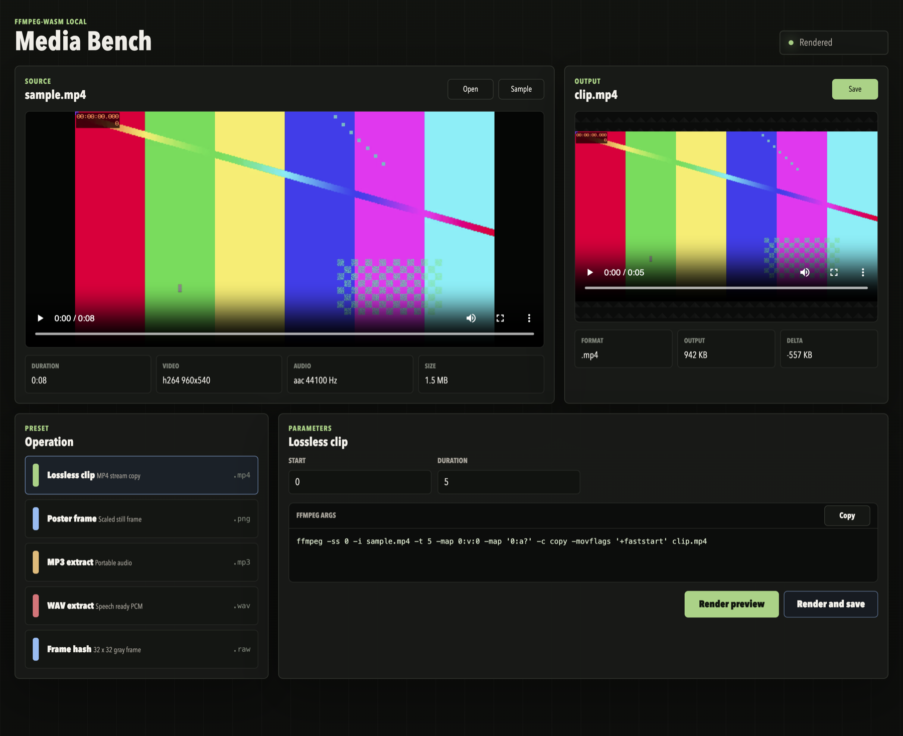

# Media Playground

Run:

```sh
pnpm playground
```

Then open `http://127.0.0.1:4173`.



## What It Does

- Opens local video or audio files.
- Generates a sample MP4 when native `ffmpeg` is installed.
- Probes duration, codec, audio, and size.
- Shows FFmpeg args before rendering.
- Renders through this package's wasm wrapper.
- Previews video, image, audio, or raw output inline.
- Saves through the browser file picker when available, with a download fallback.

## Presets

- Lossless MP4 clip.
- Poster PNG.
- MP3 extract.
- WAV extract.
- 32 x 32 grayscale raw frame.

## Local Safety

The playground server binds to `127.0.0.1` and protects render APIs with a per-server request token embedded into the served page. Cross-origin pages cannot trigger uploads or FFmpeg work without that token.
